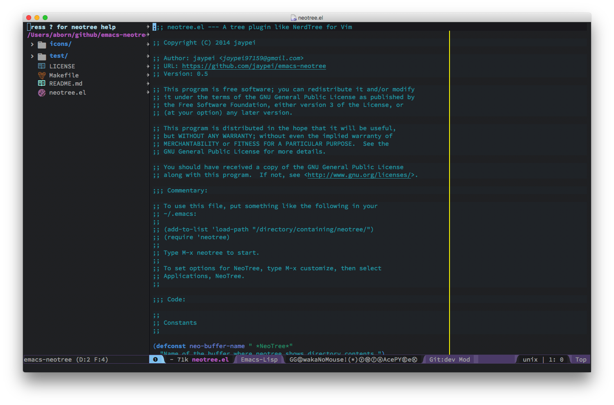

# emacs-neotree

A Emacs tree plugin like NerdTree for Vim.

[](https://travis-ci.org/jaypei/emacs-neotree)
[](http://stable.melpa.org/#/neotree)
[](https://melpa.org/#/neotree)


## Screenshots

  

## Installation

### Melpa

You can install the plugin using the packages on [melpa](http://melpa.org/).

Make sure you have something like the following in your Emacs startup file (`~/.emacs.d/init.el`, or `~/.emacs`):

```elisp
    (add-to-list 'package-archives
                 '("melpa" . "http://melpa.org/packages/"))
```

To make that take effect, either evaluate that elisp expression or restart Emacs.

Then use `M-x package-list-packages`, select `neotree` from
the list by pressing `i`, then press `x` to execute the changes. At
that point, the package will be installed.


### Source

Clone project:
```sh
$ cd /some/path
$ git clone https://github.com/jaypei/emacs-neotree.git neotree
$ cd neotree
$ git checkout dev
```

Add config to emacs:

```elisp
(add-to-list 'load-path "/some/path/neotree")
(require 'neotree)
(global-set-key [f8] 'neotree-toggle)
```

Open (toggle) NeoTree:

```
<F8>
```

## Keybindings

Only in Neotree Buffer:

* `n` next line, `p` previous line。
* `SPC` or `RET` or `TAB` Open current item if it is a file. Fold/Unfold current item if it is a directory.
* `U` Go up a directory
* `g` Refresh
* `A` Maximize/Minimize the NeoTree Window
* `H` Toggle display hidden files
* `O` Recursively open a directory
* `C-c C-n` Create a file or create a directory if filename ends with a ‘/’
* `C-c C-d` Delete a file or a directory.
* `C-c C-r` Rename a file or a directory.
* `C-c C-c` Change the root directory.
* `C-c C-p` Copy a file or a directory.


## Configurations

### Theme config
NeoTree provides following themes: *classic*(default) *ascii* *arrow* *icons* *nerd*. 
Theme can be configed by setting **neo-theme**. For example, use *icons* for window 
system and *arrow* terminal.

```elisp
(setq neo-theme (if (display-graphic-p) 'icons 'arrow))
```

**Note**: For users who want to use the `icons` theme. Pls make sure you have installed the
[all-the-icons](https://github.com/domtronn/all-the-icons.el) package and its
[fonts](https://github.com/domtronn/all-the-icons.el/tree/master/fonts).

* all-the-icons theme screenshots  


## More documentation

EmacsWiki:
[En](http://www.emacswiki.org/emacs/NeoTree)
[中文版](http://www.emacswiki.org/emacs-zh/NeoTree_%E4%B8%AD%E6%96%87wiki)
